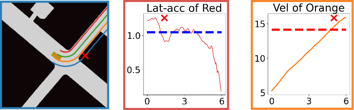
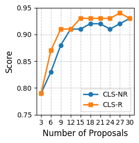

# Introduction {#sec:intro}

<figure id="fig:motivation_example" data-latex-placement="ht!">

<figcaption> This figure illustrates our framework for scoring and
selecting trajectories in autonomous driving systems. Modern autonomous
driving planners typically follow a propose-selection paradigm, where
multiple candidate trajectories are first generated and then filtered
through a scoring mechanism. As shown in the <strong>Motion Plan
Proposing</strong> block, multiple trajectories (colored lines) are
proposed as potential future paths for the autonomous vehicle. These
candidates need to be evaluated and ranked to select the most suitable
trajectory for execution. Our key contribution, the <strong>Learning
Scoring Rules</strong> block, demonstrates how we learn interpretable
scoring rules from human driving demonstration from NuPlan .
Instead of manually crafting rules or using black-box scoring models, we
develop a Scoring Logic Network (SLN) that automatically learns temporal
logic rules from data (specific rules illustrated in Sec. <a
href="#sec:logic_rules_discovered" data-reference-type="ref"
data-reference="sec:logic_rules_discovered">5.2.1</a>). These learned
rules are then deployed in the <strong>Online Monitoring and
Filtering</strong> block, which continuously evaluates the proposed
trajectories at 20 Hz following NuPlan’s log frequency  during
operation. In the scene visualization, the ego vehicle is shown in gold,
while other vehicles are represented in black, the curbs are marked in
purple, and the driveable areas (lanes and intersections) are marked as
pink and blue, respectively. Among the proposed trajectories, the green
trajectory receives the highest score as it successfully maintains a
safe distance from the curbs, while exhibiting appropriate curvature and
comfort characteristics. All other colored trajectories are not selected
for violating one or more learned rules, as detailed in Sec. <a
href="#sec:logic_rules_discovered" data-reference-type="ref"
data-reference="sec:logic_rules_discovered">5.2.1</a>. During the
monitoring, following the setting in Planning Driver Model (PDM) , we assume that the
future 4-second trajectories of other cars are known. The selected
trajectory is then executed in the <strong>Closed-Loop
Simulation</strong> block. </figcaption>
</figure>

Modern autonomous driving systems typically produce multiple potential
plans
[@Dauner2023CORL; @hu2023planning; @phan2022driving; @jiang2022efficient; @chen2024end],
as this parallel approach offers several key advantages: it allows the
system to consider different driving modalities (such as aggressive or
conservative behaviors), accounts for future uncertainties, and provides
redundancy in case certain paths become infeasible. These generated
plans then need to be evaluated through a scoring mechanism to select
the most suitable one for execution.

The importance of effective scoring becomes even more apparent in
complex autonomous driving systems, particularly in end-to-end
approaches [@hu2023planning; @chen2024end]. These systems often utilize
large, intricate neural networks that incorporate elements of
randomness, such as dropout or sampling from probability distributions.
While powerful, such characteristics can make it challenging to predict
the system's behavior consistently [@chen2024end]. By implementing
interpretable scoring rules as a final evaluation layer, we can assess
these generated plans against clear, understandable criteria, thereby
introducing much-needed predictability and reliability to these complex
systems. In essence, scoring techniques serve as a critical bridge,
connecting the raw outputs of planning algorithms to the final,
executable plans. This additional evaluation step helps mitigate the
uncertainties inherent in complex planning systems, significantly
enhancing the safety, efficiency, and overall performance of autonomous
vehicles as they navigate through our highways and cities.

With real-world driving data available in datasets like NuPlan
[@Karnchanachari2024TowardsLP], most current learning methods focus on
directly learning motion plan proposers rather than learning
interpretable scoring mechanisms to evaluate these plans. We instead
focus on learning scoring rules represented in temporal logic for
evaluating autonomous driving plans, which assess and rank plans
generated by motion plan proposers. These scoring rules capture the
latent relationships between various driving rules and constraints; for
example, if a vehicle has a safe time-to-collision with surrounding
vehicles, it should always be subject to all comfort constraints. By
applying these rules to the output of a motion planner, we can score and
select desirable plans, ensuring that the planned paths adhere to safety
standards and traffic regulations while maintaining optimal performance.
Figure [1](#fig:motivation_example){reference-type="ref"
reference="fig:motivation_example"} illustrates the learning process and
how we might apply scoring rules.

In practice, building these scoring rules presents several significant
challenges. First, *the latent relationships and dependencies among
various rules are often non-trivial*. For instance, while a vehicle is
generally not permitted to exceed the speed limit, exceptions may exist
in specific scenarios such as overtaking another vehicle. These nuanced
dependencies make it challenging to create a comprehensive set of rules
that account for all possible situations. Second, *determining the
optimal parameters for rules is a complex task*. For example,
establishing appropriate thresholds for safe time-to-collision,
comfortable acceleration, or acceptable steering angle requires careful
consideration of multiple factors. These parameters must balance safety
concerns with the need for efficient and smooth vehicle operation.
Third, *available demonstration data typically only showcases correct
behavior and lacks sufficient examples of incorrect actions*
[@Karnchanachari2024TowardsLP; @akhauri2020enhanced; @chen2024end].
Having only single-class (i.e., correct-behavior only) training data
poses a significant challenge for learning scoring models, as they must
learn to distinguish between acceptable and unacceptable behaviors
without a sufficient number of explicit negative samples.

Our approach addresses these challenges through three interconnected key
ideas. First, to capture latent relationships among driving rules, we
introduce a learnable logic structure that seamlessly integrates
temporal and propositional logic. Our structure can represent nuanced
decisions such as when it is appropriate to exceed the speed limit for a
safe overtaking maneuver. Second, we tackle the challenge of parameter
optimization by letting the data speak for itself. Rather than relying
on manual tuning, our system learns optimal rule parameters directly
from driving demonstrations, leveraging the fully differentiable logic
structure used to represent rules. Third, we overcome the limitation of
learning from only positive examples through a novel
regularization-constrained optimization framework that simultaneously
rewards correct demonstration behaviors and restricts the space of
acceptable ones.

We evaluate the efficacy of our learned scoring rules in NuPlan
[@Karnchanachari2024TowardsLP] closed-loop simulations. These results
demonstrate that our learned rules can effectively score and select
desirable plans, outperforming both expert-crafted rules and neural
network-based approaches when considering both interactive and
non-interactive scenarios. We further show that the learned rules
perform consistently well across different proposers, including PDM
[@Dauner2023CORL], PDM-Hybrid [@Dauner2023CORL], ML-Prop
[@Karnchanachari2024TowardsLP], and a rule-based Acceleration-Time (AT)
sampler [@jiang2022efficient]. In summary, our contributions are as
follows:

- We propose a novel learnable logic structure that discovers and
  captures latent relationships represented in temporal logic.

- We introduce a data-driven approach to optimize rule parameters,
  enabling the system to learn effective scoring rules from driving
  demonstrations.

- We present an optimization framework that allows the system to learn
  rules and parameters from human driving demonstrations, without
  requiring unsafe and rare accident examples.

- We demonstrate the effectiveness of our approach in scoring and
  selecting desirable plans via NuPlan closed-loop simulation,
  outperforming expert-crafted rules [@Dauner2023CORL] and neural
  network-based approaches [@jiang2022efficient] across various
  scenarios and proposers.

# Related Work

Scoring models are widely used in autonomous driving systems to evaluate
the safety, efficiency, and comfort of planned trajectories
[@Dauner2023CORL; @Karnchanachari2024TowardsLP; @hu2023planning; @xiao2021rule; @wishart2020driving; @junietz2018criticality; @hekmatnejad2019encoding; @Deng2023TARGETAS; @Zhou2023SpecificationBasedAD; @houston2021one; @riedmaier2020survey; @weng2020model; @vasudevan2024planningadaptiveworldmodels; @phan2022driving; @huang2021driving; @kuderer2015learning; @wulfmeier2017large; @silver2012learning; @jiang2022efficient].
This evaluation becomes particularly crucial in end-to-end autonomous
driving systems, where behavioral uncertainties arise from multiple
sources: neural network stochasticity (e.g., dropout, distributional
sampling) [@hu2023planning], environmental condition
variations [@hu2023planning], and complex multi-agent interaction
modeling [@chen2024end].

Existing scoring models can be broadly categorized into rule-based and
learning-based models. Rule-based scoring models
[@Dauner2023CORL; @Karnchanachari2024TowardsLP; @hu2023planning; @xiao2021rule; @wishart2020driving; @junietz2018criticality; @hekmatnejad2019encoding; @Deng2023TARGETAS; @Zhou2023SpecificationBasedAD; @houston2021one; @riedmaier2020survey]
leverage expert knowledge and domain-specific rules, offering
interpretability but lacking data-driven adaptability. In contrast,
learning-based scoring models, typically approximated with deep neural
network,
[@weng2020model; @vasudevan2024planningadaptiveworldmodels; @phan2022driving; @huang2021driving; @kuderer2015learning; @wulfmeier2017large; @silver2012learning; @jiang2022efficient]
are data-driven and can capture complex patterns, but often sacrifice
interpretability, which can be intimidating for safety-critical
applications.

In the broader context of temporal logic rule learning
[@bartocci2022survey], some researchers have explored learning
interpretable rules from demonstrations. However, the current literature
has not explored the potential of learning interpretable rules directly
from driving data, in the context of autonomous driving systems.

# Preliminaries {#sec:problem_formulation}

In this section, we formulate the key technical components and our
objectives.

#### Predicate $P_{\theta}$

At a certain time point, given all environment information
$\mathcal{E} = (M, I, A)$ and a motion plan $\tau$, the differentiable
predicate $P_{\theta}$ is defined as:
$P_{\theta}: (\mathcal{E} \times \tau) \rightarrow [-1, 1]$, which
evaluates driving conditions and the ego car's motion plan [^2]. Here,
$M$ represents the HD map API that provides the functionality to query a
drivable area, lane information, routing information and occupancy grid;
$I = \{i_1,...,i_K\}$ represents the set of traffic light states, where
each $i_k \in \{\mathit{red, yellow, green}\}$; $A = \{a_1,...,a_N\}$
represents the set of other agents, where each
$a_i = \{(x_t, y_t, v_t)\}_{t=0}^{T}$ contains the agent's trajectory
for the next 4 seconds (i.e., $T = 80$, $20Hz \times 4 s$). The motion
plan $\tau = \{(x_t, y_t, v_t)\}_{t=0}^{T}$ consisting of a sequence of
positions $(x_t, y_t)$ and speeds $v_t$, where higher-order derivatives
(e.g., acceleration, jerk) can be computed through numerical
differentiation when needed. $P_{\theta}$ maps $\mathcal{E}$ and $\tau$
to a truth confidence value in $[-1,1]$, where $\theta$ are the
predicate parameters. Each predicate $P_{\theta}$ is parameterized by
$\theta$, which defines thresholds or constraints specific to that
predicate (e.g., safe time-to-collision threshold, comfortable
acceleration bounds). When designing the predicate, we ensure that the
gradient $\nabla_{\theta} P_{\theta}$ exists and can be computed. The
sign of $P_{\theta}$ indicates truth. $P_{\theta}< 0$ implies False;
$P_{\theta}> 0$ implies True. The absolute value $|P_{\theta}|$
indicates the degree of confidence. Similar to most existing work
[@bartocci2022survey], we explicitly design the predicates and focus
this paper on learning logical connections and parameters assuming a
given set of predicates. With the predicate defined, we can now move on
to discussing how these predicates are combined into logical formulas.

#### Formula $\mathcal{L}$

Given a differentiable predicate set
$\mathcal{P}= \{P^{1}_{\theta_1}, P^{2}_{\theta_2}, \ldots, P^{n}_{\theta_n}\}$,
we introduce a $\mathtt{LTL}_f$ logic space [@LTLf] (LTL over finite
traces) that includes compositions of predicates from $\mathcal{P}$ and
logic operators. The logic formula $\mathcal{L}$ can be generated from
the following grammar: $$\begin{align}
    \mathcal{L} := P_{\theta}\mid \mathbf{G}\ \mathcal{L} \mid \mathbf{F}\ \mathcal{L} \mid \lnot \mathcal{L} \mid \mathcal{L} \land \mathcal{L}' \mid \mathcal{L} \lor \mathcal{L}'
\end{align}$$ []{#eq:logic_formula_syntax
label="eq:logic_formula_syntax"} where $P_{\theta}\in \mathcal{P}$ is a
differentiable predicate, $\mathbf{G}$ and $\mathbf{F}$ are temporal
operators representing "globally" and "finally" respectively, $\lnot$ is
logical negation, $\land$ is logical and, and $\lor$ is logical or. Like
most existing work [@bartocci2022survey], the strong "Until"
($\mathcal{L}\ \mathbf{U}\ \mathcal{L}'$) is not included because it can
be represented using existing logic operators
($\mathbf{F}\ \mathcal{L}' \wedge \mathbf{G}(\mathcal{L} \lor \mathcal{L}')$).
Having established the syntax for our logic formulas, we now need a way
to evaluate them quantitatively.

#### Quantitative Evaluation of Formula

Given a finite input sequence $S = \{(\mathcal{E}_t, \tau_t)\}_{t=0}^T$
sampled at different time points, up to a bounded time $T$, we can
evaluate the logic formula $\mathcal{L}$ quantitatively using a set of
min and max operators[@fainekos2009robustness; @deshmukh2017robust].
This evaluation maps the sequence $S$ to a value in $[-1, 1]$, denoted
as $\mathcal{L}(S; \boldsymbol{\theta}) \rightarrow [-1, 1].$ Here,
$\boldsymbol{\theta}$ represents all the predicates' parameters.
Specifically, we define the quantitative evaluation of an atomic
predicate $P_{\theta}$ at time $t$ as
$P_{\theta}(\mathcal{E}_t, \tau_t) \in [-1, 1]$. In
[\[eq:temporal_operators\]](#eq:temporal_operators){reference-type="eqref"
reference="eq:temporal_operators"}, the temporal logic operators
$\mathbf{G}$ and $\mathbf{F}$ evaluate the formula $\mathcal{L}$ over
the entire sequence from time $t$ onwards. $\mathbf{G}\mathcal{L}$
(globally) returns the minimum value of $\mathcal{L}$ over all future
time points, which ensures the property holds throughout the sequence if
$\mathbf{G}\mathcal{L}$ evaluates to a positive value.
$\mathbf{F}\mathcal{L}$ (finally) returns the maximum value, indicating
the property is satisfied at least once in the future. The evaluation
function $\rho$ is defined as: $$\begin{equation}
    \begin{aligned}
        \rho(\mathbf{G}\mathcal{L}, t) & = \min_{t' \geq t} \rho(\mathcal{L}, t') \quad & \rho(\mathbf{F}\mathcal{L}, t) & = \max_{t' \geq t} \rho(\mathcal{L}, t')
    \end{aligned}
\end{equation}$$ []{#eq:temporal_operators
label="eq:temporal_operators"} For single time point evaluation, the
logical operators and ($\land$), or ($\lor$), and not ($\lnot$) are
defined using min, max, and negation operations: $$\begin{equation}
    \begin{aligned}
         & \rho(\mathcal{L} \land \mathcal{L}', t) & = & \min\{\rho(\mathcal{L}, t), \rho(\mathcal{L}', t)\} \\
         & \rho(\mathcal{L} \lor \mathcal{L}', t)  & = & \max\{\rho(\mathcal{L}, t), \rho(\mathcal{L}', t)\} \\
         & \rho(\lnot \mathcal{L}, t)              & = & -\rho(\mathcal{L}, t)
    \end{aligned}
\end{equation}$$ []{#eq:fol_operators label="eq:fol_operators"} All the
operations defined by $\rho$ are differentiable, which enables the use
of backpropagation in the learning process. In practice, we use softmin
and softmax to approximate min and max operators for a smooth gradient
[@Leung2020BackpropagationTS]. With the evaluation framework in place,
we can now define our overall objective for learning optimal driving
rules. For simplicity, we define $\rho(\cdot):= \rho(\cdot, 0)$, meaning
evaluate from the initial of input sequence.

#### Objective

Our objective is twofold: (1) learn the optimal logic formula
$\mathcal{L}^*$, and (2) optimize the parameters $\boldsymbol{\theta}$
of the predicates, which characterize the demonstration data accurately.
Formally, we aim to solve the following problem: $$\begin{align}
    \mathcal{L}^*, \boldsymbol{\theta}^* = \mathop{\mathrm{argmax}}_{\mathcal{L} \in \Omega_\mathcal{P}, \boldsymbol{\theta}} \mathbb{E}_{S \sim \mathcal{D}^+} [\mathcal{L}(S; \boldsymbol{\theta})]
\end{align}$$ []{#eq:objective label="eq:objective"} where
$\mathcal{D}^+$ represents driving demonstrations, which consist
*solely* of correct demonstrations that represent ideal driving
behaviors.

# Approach {#sec:approach}

This section presents our approach to learning interpretable driving
rules from demonstrations. We begin by introducing the concept of
condition-action pairs in
Sec. [4.1](#sec:condition-action-pair){reference-type="ref"
reference="sec:condition-action-pair"}, which forms the foundation of
our rule representation.
Sec. [4.2](#sec:learnable_logic_structure){reference-type="ref"
reference="sec:learnable_logic_structure"} introduces the core of our
method: the learnable logic structure. Here, we explain its components,
analyze its capabilities, and describe how we extract and simplify rules
from it. Finally,
Sec. [4.3](#sec:learning_from_single_class_demonstration){reference-type="ref"
reference="sec:learning_from_single_class_demonstration"} introduces our
novel regularization techniques to overcome the limitations of learning
from positive-only examples.

## Condition-Action Pair {#sec:condition-action-pair}

We consider rules that consist of conditions and expected actions. For
instance, one such rule might require that the ego car eventually stop
when approaching a stop sign. This pattern of condition-action pairing
extends to countless driving situations. Thus, we focus on effectively
learning and reducing driving rules to condition-action pairs.

Predicates are the basic unit of our rules. We categorize our predicates
into two types: condition predicates
$\bar{\mathcal{P}} = \{\bar{P^{1}_{\theta_1}}, \bar{P^{2}_{\theta_2}}, \ldots, \bar{P^{n}_{\theta_n}}\}$
and action predicates
$\dot{\mathcal{P}} = \{\dot{P^{1}_{\theta_1}}, \dot{P^{2}_{\theta_2}}, \ldots, \dot{P^{m}_{\theta_m}}\}$.
Condition predicates evaluate traffic conditions (e.g., if approaching a
stop sign), while action predicates assess the motion plan (e.g. if the
ego car is stopped). Given $$\begin{equation}
    \begin{aligned}
        \mathit{condition} & := \bar{P_{\theta}} \mid \mathbf{G}\ condition \mid \mathbf{F}\ \mathit{condition} \mid \lnot \mathit{condition} \\
        \mathit{action}    & := \dot{P_{\theta}} \mid \mathbf{G}\ \mathit{action} \mid \mathbf{F}\ \mathit{action} \mid \lnot \mathit{action}
    \end{aligned}
\end{equation}$$ we extract and simplify the learned logic formula
$\mathcal{L}$ to a set of propositional rules of the form:
$$\begin{equation}
    \label{eq:condition_action_pair}
    \bigodot_{i=1}^m \left(\bigwedge_{j=1}^n condition_j \rightarrow action_i\right)
\end{equation}$$ where $\bigodot$ denotes that this condition-action
pairs are connected by $\land$ or $\lor$ operators. The conjunction of
conditions ($\bigwedge_{j=1}^n condition_j$) allows for more precise and
specific criteria to be defined for each action, thereby describing
precisely when the action should be allowed. Building upon this
foundation, we introduce a learnable logic structure to represent and
learn these condition-action pairs.

## Learnable Logic Structure {#sec:learnable_logic_structure}

The learnable logic structure $\bar{\mathcal{L}}$ is a directed acyclic
computation graph that represents a compositional logic formula. It
consists of three types of layers: **Temporal, Propositional**, and
**Aggregation**. These layers are interconnected through learnable gates
that determine the flow and combination of logical operations. An
example of this structure is shown in
Fig. [2](#fig:learnable_logic_structure){reference-type="ref"
reference="fig:learnable_logic_structure"}.

<figure id="fig:learnable_logic_structure" data-latex-placement="!htp">

<figcaption> The logic structure \(\bar{\mathcal{L}}\) consists of three types
of layers: <strong>Temporal, Propositional</strong>, and
<strong>Aggregation</strong>. The <strong>Temporal</strong> layer
processes the initial predicates, applying temporal operators. The
<strong>Propositional</strong> layer generates all possible pairs of
predicates connected by logical operators. The
<strong>Aggregation</strong> layer aggregates the output of the
<strong>Propositional</strong> layer into one cluster by deciding the
logic operator to connect neighboring clusters.
<strong>Temporal</strong> layers can be stacked. a layer’s formal
definition is in Sec. <a href="#sec:layer_definition"
data-reference-type="ref"
data-reference="sec:layer_definition">4.2.1</a>. Two types of gates, the
, and the , are used to control the logic operators and the sign of the
cluster inputs, respectively. Each clear circle (\(\bigcirc\)) in these gates represents a
single value <em>weight</em>. In the selection gate, the circle
represents the operator with the largest weight, meaning the operator is
selected. In the negation gate, the circle represents the negation of
the input (i.e., multiply with a negative number), while the circle
represents the original input (i.e., a positive number). The gate
implementation is described in Sec. <a href="#sec:gate_implementation"
data-reference-type="ref"
data-reference="sec:gate_implementation">4.2.2</a>. Supposing we only
consider one layer of Temporal layer (\(n =
1\)), and given a set of predicates \(\mathcal{P}= \{P^{1}_{\theta_1}, P^{2}_{\theta_2},
P^{3}_{\theta_3}\}\), \(P^{2}_{\theta_2} \in \bar{\mathcal{P}}\)
and \(P^{1}_{\theta_1}, P^{3}_{\theta_3} \in
\dot{\mathcal{P}}\), this learnable logic structure represents
the logic formula \((\mathbf{G}P^{1}_{\theta_1} \lor \lnot
P^{2}_{\theta_2}) \lor (\lnot \mathbf{G}P^{1}_{\theta_1} \land
\mathbf{F}P^{3}_{\theta_3}) \lor (\lnot P^{2}_{\theta_2} \land
\mathbf{F}P^{3}_{\theta_3})\) This formula can be further reduced
to \(P^{2}_{\theta_2} \rightarrow
(\mathbf{G}P^{1}_{\theta_1} \lor \mathbf{F}P^{3}_{\theta_3})\).
</figcaption>
</figure>

### Layer Definition {#sec:layer_definition}

In the bottom block of
Fig. [2](#fig:learnable_logic_structure){reference-type="ref"
reference="fig:learnable_logic_structure"}, the frame batch is processed
through $\mathcal{P}$ and then passed through **Temporal** layers. Let
$F = \{f_1, f_2, ..., f_T\}$ be a sequence of $T$ frames, where each
frame represents a time point. Define
$\mathcal{P}= \{P^{1}_{\theta_1}, P^{2}_{\theta_2}, ..., P^{N}_{\theta_N}\}$
as a set of $N$ predicates. For each predicate
$P^{i}_{\theta_i} \in \mathcal{P}$ and each frame $f_t \in F$, we
compute $X_i^t = P^{i}_{\theta_i}(f_t)$. Let
$X_i^T = [x_i^1, x_i^2, ..., x_i^T]$ be the sequence of predicate values
for predicate $P^{i}_{\theta_i}$ across all time steps. The output of
the predicates is then defined as
$\mathcal{X}^T = \{X_1^T, X_2^T, ..., X_N^T\}$, where each
$X_i^T \in \mathbb{R}^T$ contains the predicate values computed over the
entire time sequence for the $i$-th predicate. These frame sequences can
be batched as shown in
Fig. [2](#fig:learnable_logic_structure){reference-type="ref"
reference="fig:learnable_logic_structure"}, to simplify the symbols, we
only discuss the case with batch size one in the following parts.

The **Temporal** layer $\mathcal{T}$ operates on each element
$X_i^T \in \mathcal{X}^T$, potentially applying a temporal operator.
Formally, the output of $\mathcal{T}$ is
$O^T  = \mathcal{T}(\mathcal{X}^T) = \{o^T_1, o^T_2, \ldots, o^T_N\}$,
where
$o^T_i = \mathcal{T}(x_i^T) \in \{\mathbf{G} X_i^T, \mathbf{F} X_i^T, X_i^T\}$.
Temporal layers can be stacked, allowing for the composition of temporal
operators. For instance, with two stacked temporal layers, we could have
$\mathcal{T}_2(\mathcal{T}_1(X_i^T)) = \mathbf{F}(\mathbf{G}(X_i^T))$.
This composition allows for expressing more nuanced and complex temporal
properties.

The **Propositional** logic layer $\mathcal{F}$ operates on its input
set $O^T$, generating ${N \choose 2}$ clusters, each containing a
combination of two inputs connected by a logical operator. The behavior
of $\mathcal{F}$ is formalized as
$\mathcal{F}(O^T) = O^P = \{o_1^P, o_2^P, \ldots, o_{N \choose 2}^P\}$,
where $o_i^P = (\lnot) o_j^T \circ (\lnot) o_k^T$,
$\circ \in \{\land, \lor\}$, and $O^T = \{o^T_1, o^T_2, \ldots, o^T_N\}$
is the output of a **Temporal** layer. Here, $j$ and $k$ represent the
indices of the two different inputs being combined. Each input can be
negated or unchanged when passing through a logic layer. We do not stack
the **Propositional** layer as it would lead to exponential growth in
the number of clusters; aggregating on one **Propositional** layer can
represent any formula in the form of
[\[eq:condition_action_pair\]](#eq:condition_action_pair){reference-type="eqref"
reference="eq:condition_action_pair"} as we show in
[4.2.3](#sec:logic_space_analysis){reference-type="ref"
reference="sec:logic_space_analysis"}.

The **Aggregation** layer aggregates the output of the **Propositional**
($O^P$) layer into one cluster using logical connectives
$\{\land, \lor\}$ to connect neighboring clusters. Formally, given the
input $O^P$, the output of the **Aggregation** layer can be represented
as
$\mathcal{A}(O^P) = o^P_1 \circ_1 o^P_2 \circ_2 \ldots \circ_{{N \choose 2} - 1} o^P_{N \choose 2}$,
where $\circ$ represents $\land$ or $\lor$.

A logic structure can be formally defined as
$\bar{\mathcal{L}}  = \mathcal{A}(\mathcal{F}(\mathcal{T}^{\times n}(\mathcal{P}))),$
where $n$ is the number of stacked Temporal layers.

### Gate Implementation {#sec:gate_implementation}

The layers in
Fig. [2](#fig:learnable_logic_structure){reference-type="ref"
reference="fig:learnable_logic_structure"} are composed of selection
gates and negation gates. Each $\bigcirc$ in these gates represents a
weight $w \in \mathbb{R}$.

The   acts as a soft attention mechanism to select between different
operators across all layers (i.e., $\mathbf{G}, \mathbf{F}$ and identity
operator in the Temporal layer, $\land, \lor$ in the **Propositional**
and **Aggregation** layers), defined as: $$\begin{equation}
    g_s(O) = \sigma([w_s^1 ; \cdots ; w_s^k]) \cdot [o_1 ; \cdots ; o_k]^T
\end{equation}$$ where $\sigma(\cdot)$ denotes the softmax function. For
temporal operators in the **Temporal** layer,
$O = [\rho(\mathbf{G}X_i^T), \rho(\mathbf{F}X_i^T), \rho(X_i^T)]^\top \in \mathbb{R}^3$
and $k=3$. For logic operators in the **Propositional** and
**Aggregation** layers,
$O = [\rho(o_1 \land o_2), \rho(o_1 \lor o_2)]^\top \in \mathbb{R}^2$
and $k=2$. The evaluation function $\rho$ is defined in
[\[eq:temporal_operators\]](#eq:temporal_operators){reference-type="eqref"
reference="eq:temporal_operators"} and
[\[eq:fol_operators\]](#eq:fol_operators){reference-type="eqref"
reference="eq:fol_operators"}. The selection gate blends operators using
softmax to enable continuous gradient flow during training.

The , given by $g_n = \tanh(w_{neg}) \cdot x$, with learnable parameters
$w_{neg}$, controls the sign of cluster $x$ inputs to the Propositional
layer. $$\begin{equation}
    g_n = \tanh(w_{neg}) \cdot x, \quad w_{neg} \in \mathbb{R}, x \in \mathbb{R}
\end{equation}$$ The $\tanh$ function constrains the output to
$[-1, 1]$. According to the quantitative semantics defined in
[\[eq:fol_operators\]](#eq:fol_operators){reference-type="eqref"
reference="eq:fol_operators"}, multiplying by a negative value negates
the input. The gradient properties of $\tanh$ encourage $w_{neg}$ to
converge towards either $-1$ or $1$ during training, effectively
learning whether to negate the input.

### Logic Space Analysis {#sec:logic_space_analysis}

Stacking **Temporal** layers monotonically increases the logic space.
Creating a logic space that contains up to $n$ nested temporal operators
can be easily achieved by stacking $n$ **Temporal** layers. For the
**Propositional** layer, we assert that:

::: theorem
**Theorem 1**. *Aggregating the output from a single **Propositional**
layer can represent any formula in the form of
[\[eq:condition_action_pair\]](#eq:condition_action_pair){reference-type="eqref"
reference="eq:condition_action_pair"}.*
:::

::: proof
*Proof.* Consider a **Propositional** layer with inputs
${\mathit{condition_1, \ldots, condition_n, action_1, \ldots, action_m}}$.
For each $\mathit{action_i}$, combine:
$$(\lnot \mathit{condition_1 \lor action_i) \land \ldots \land (\lnot condition_n \lor action_i})$$
This is equivalent to
$(\mathit{condition_1 \land \ldots \land condition_n) \rightarrow action_i}$.
Aggregating for all $\mathit{action_i}$ yields:
$$\bigodot_{i=1}^m \left((\mathit{condition_1 \land \ldots \land condition_n) \rightarrow action_i}\right)$$
where $\bigodot$ is either $\land$ or $\lor$, matching the theorem's
form. ◻
:::

This theorem proves that a single **Propositional** layer is sufficient
to express all condition-action pairs, justifying our computationally
efficient design choice.

### Ensembling {#sec:ensembling}

Given a set of logic structures
$\{\bar{\mathcal{L}}_1, \bar{\mathcal{L}}_2, \ldots, \bar{\mathcal{L}}_k\}$,
we can ensemble them by aggregating their outputs with an additional
**Aggregation** layer. Formally, $$\begin{equation}
    \begin{aligned}
        \bar{\mathcal{L}}_{\text{ensemble}} & = \mathcal{A}(\bar{\mathcal{L}}_1, \bar{\mathcal{L}}_2, \ldots, \bar{\mathcal{L}}_k)
    \end{aligned}
\end{equation}$$ In practice, we noticed that ensembling multiple logic
structures can improve the robustness of the learned rules.

### Rule Extraction and Simplification {#sec:rule_extraction_and_simplification}

The rule extraction and simplification process transforms the learned
logic structure into interpretable condition-action pairs. To interpret
the learned logic structure $\bar{\mathcal{L}}$, we extract its logic
formula $\mathcal{L}$ by traversing the structure and selecting the most
probable operators by concretizing the selection gates and negation
gates. Given a selection gate $g_s$, let $\mathcal{C}(\cdot)$ denote the
concretizing function: $$\begin{equation}
    \begin{aligned}
        \mathcal{C}(g_s) & = \mathop{\mathrm{argmax}}_{op} w^{op}_s, \quad op \in \begin{cases}
                                                                     \{\mathbf{G}, \mathbf{F}, \text{id}\}, \\
                                                                     \{\land, \lor\},
                                                                 \end{cases}
    \end{aligned}
\end{equation}$$ []{#eq:selection_gate_concretizing
label="eq:selection_gate_concretizing"} where $w^{op}_s$ represents the
weights associated with each operator in the selection gate. For the
negation gate $g_n$, the concretizing is determined by the sign of the
weight: $$\begin{equation}
    \begin{aligned}
        \mathcal{C}(g_n) & = \begin{cases}
                                 \text{negation}, & \text{if } w_{neg} < 0 \\
                                 \text{original}, & \text{otherwise}
                             \end{cases}
    \end{aligned}
\end{equation}$$ []{#eq:negation_gate_concretizing
label="eq:negation_gate_concretizing"}

A concrete example is shown in
Fig. [2](#fig:learnable_logic_structure){reference-type="ref"
reference="fig:learnable_logic_structure"} by iteratively applying
[\[eq:selection_gate_concretizing\]](#eq:selection_gate_concretizing){reference-type="eqref"
reference="eq:selection_gate_concretizing"} and
[\[eq:negation_gate_concretizing\]](#eq:negation_gate_concretizing){reference-type="eqref"
reference="eq:negation_gate_concretizing"} to the selection and negation
gates. For an ensemble logic structure, we only need to apply the same
rule further for the additional Aggregation layer.

The extracted formula is then simplified to a set of condition-action
pairs in the form of
[\[eq:condition_action_pair\]](#eq:condition_action_pair){reference-type="eqref"
reference="eq:condition_action_pair"}. We apply the Quine-McCluskey
algorithm [@McCluskey1956MinimizationOB] to simplify the extracted
formula. Such simplification removes redundant cluster (e.g.,
$\land (P^{1}_{\theta_1} \lor \lnot P^{1}_{\theta_1})$). The resulting
formula is then converted to conjunctive normal form:
$\bigwedge_{i=1}^n \left( \bigvee_{j=1}^m \bar{P}_j \lor \bigvee_{k=1}^l \dot{P}_k \right),$
where $\bar{P}_j$ and $\dot{P}_k$ represent condition and action
predicates, respectively. By double negating the condition predicates
and applying De Morgan's laws, this formula can be further simplified to
condition-action pairs in the form of
[\[eq:condition_action_pair\]](#eq:condition_action_pair){reference-type="eqref"
reference="eq:condition_action_pair"}.

## Learning From Demonstration {#sec:learning_from_single_class_demonstration}

Most demonstration datasets consist solely of examples representing
ideal driving behaviors. Our goal is to learn the logic structure
$\bar{\mathcal{L}}^*$ [^3] and predicate parameters
$\boldsymbol{\theta}^*$ that grade demonstrations with the highest score
and unseen behaviors with lower scores. Directly optimizing on
[\[eq:objective\]](#eq:objective){reference-type="eqref"
reference="eq:objective"} would simply make the score
$\bar{\mathcal{L}}(S; \boldsymbol{\theta})$ to be 1 for all
demonstrations. The optimizer could find "shortcuts" and result in
learning trivial formulas like
$P^{1}_{\theta_1} \lor \lnot P^{1}_{\theta_1}$, which are always true
and do not provide meaningful rules. To address this issue, we introduce
two regularization terms for $\boldsymbol{\theta}$ and
$\bar{\mathcal{L}}$. The full learning algorithm is presented in
Algorithm
[\[algo:train-with-regularization\]](#algo:train-with-regularization){reference-type="ref"
reference="algo:train-with-regularization"}.

::: algorithm
$\bar{\mathcal{L}}^* \leftarrow \bar{\mathcal{L}}$,
$\boldsymbol{\theta}^* \leftarrow \boldsymbol{\theta}$
:::

The learning system evaluates driving behaviors in a state space
$S = \{(\mathcal{E}_t, \tau_t)\}_{t=0}^T$, where behaviors with
$\bar{\mathcal{L}}(S; \boldsymbol{\theta}) > 0$ are considered
acceptable. Without constraints, the system might learn shortcuts that
accept almost any behavior. We prevent this through two types of
regularization:

### Preventing Shortcut Learning Through Regularization

The learning system evaluates driving behaviors in a state space
$S = \{(\mathcal{E}_t, \tau_t)\}_{t=0}^T$, where behaviors with
$\bar{\mathcal{L}}(S; \boldsymbol{\theta}) > 0$ are considered
acceptable. Without constraints, the system might learn shortcuts that
accept almost any behavior. Consider a simple example where we want to
learn rules for safe lane changes. Without regularization, the system
might learn the rule: $\text{InLane} \lor \text{SafeDistance}$ that
accepts behaviors in which the car is either in a lane OR maintains safe
distance, which is clearly too permissive. We prevent such shortcuts
through two types of regularization: First, we gradually tighten the
parameters $\boldsymbol{\theta}$ of each rule using:
$\boldsymbol{\theta} = \boldsymbol{\theta} - \alpha \cdot \text{sign}\left(\frac{\partial \bar{\mathcal{L}}}{\partial \boldsymbol{\theta}}\right).$
In our example, this might gradually increase the required safe distance
threshold from 1 meter to a more reasonable 2 meters. Second, when
combining rules, we encourage the use of AND ($\land$) over OR ($\lor$)
operations using:
$w_{op}^{\land} = \min(w_{op}^{\land} + \beta, w_{\max})$ This helps the
system learn more appropriate rules like:
$\text{InLane} \land \text{SafeDistance}$ requiring both conditions to
be met for a safe lane change.

Importantly, these constraints only eliminate spurious shortcuts - any
rule structure or parameter that genuinely captures important driving
behavior will remain intact, as it will be consistently reinforced by
the demonstration data despite the regularization pressure.

# Experiments

## General Experiment Setup

We consider 63 condition predicates and 20 action predicates in the
predicate set $\mathcal{P}$. All predicates are categorized into four
types: (1) safety-related (e.g., will the plan result in obstacle
collision?) (2) comfort-related (e.g., is the acceleration in a
reasonable range?); (3) efficiency-related (e.g., is the car is in a
slow lane?); (4) environment-related (e.g., is the curvature of the
current lane too high?). Implementing the predicate set $\mathcal{P}$
involves LLM-aided design [@Chen2022CodeTCG], but the final predicates
were manually checked to ensure correctness and sensibility.

We used all the NuPlan demonstrations in Singapore, Pittsburgh, and
Boston, and part of the demonstrations in Las Vegas, to train the logic
structure. The scenarios are grouped into 9 types (the first column in
Table [2](#tab: closed-loop-planning-performance){reference-type="ref"
reference="tab: closed-loop-planning-performance"}). The dataset is
split into 90% training and 10% validation. The validation set is used
for hyperparameter tuning and early stopping. Following PDM
[@Dauner2023CORL], we use the log replay to obtain the 4-second future
trajectories of other agents in both training and evaluation.

We trained an ensemble $\mathcal{L}_{\mathit{ensemble}}$ with 10
different $\mathcal{L}$. Each $\mathcal{L}$ has 2 layers of the Temporal
layer. The single class regularization parameters $\alpha$ and $\beta$
are set to $10^{-5}$ and $10^{-3}$, respectively. The learning rate is
set to $10^{-4}$, and optimized with the Adam optimizer. The batch size
is set to 32. The training process is stopped when the validation loss
does not decrease for 10 epochs. We used 15 trajectory candidates for
evaluation in closed-loop simulation.

## Case Study

### Logic Rules Discovered {#sec:logic_rules_discovered}

Fig. [1](#fig:motivation_example){reference-type="ref"
reference="fig:motivation_example"} shows three of the rules learned by
the grading logic network. Given the motion plan proposed by PDM
[@Dauner2023CORL], the grading logic network assigns a score to each
plan based on the learned rules.
Fig. [3](#fig:case-study-example){reference-type="ref"
reference="fig:case-study-example"} shows why the
[blue]{style="color: 2278B4"}, [red]{style="color: D52928"} and
[orange]{style="color: F98217"} plans receive lower scores. The blue
plan receives a low score for going beyond the drivable area (the gray
area), which violates the rule
$\top \rightarrow \mathbf{G} \mathit{InDrivable}$. The red plan is
penalized for exceeding comfort constraints (the blue dashed line) on
lateral acceleration, which violates the rule
$\mathbf{G} \mathit{SafeTTC} \rightarrow \mathbf{G} \mathit{Comfortable}$.
The orange plan receives a lower score for exceeding the speed limit
(the red dashed line) when not overtaking another vehicle, which
violates the rule
$\lnot \mathit{SpeedLimit} \rightarrow \mathbf{F} \mathit{Overtaking}$.
These rules are almost always discovered in our experiment. One
exception is that the rule
$\lnot \mathit{SpeedLimit} \rightarrow \mathbf{F}\mathit{Overtaking}$
could sometimes devolve to $\mathit{SpeedLimit}$ or
$\mathbf{G}\mathit{SpeedLimit}$ in scenarios where overtaking happens
rarely (e.g., following other cars). More detailed case studies are
provided on our website.

<figure id="fig:case-study-example" data-latex-placement="h!">

<figcaption> Case study on discovered rules. While our method evaluates
15 trajectory candidates in practice, we show only 4 representative
trajectories here for visual clarity. From left to right, these
sub-figures explain why the blue, red, and orange plans received lower
scores. The blue plan violates the drivable area rule, the red plan
exceeds comfort constraints on lateral acceleration, and the orange plan
breaks the speed limit without overtaking context. </figcaption>
</figure>

### Parameter Optimization

$\mathit{Comfortable}_{\boldsymbol{\theta}}$ is a predicate measure if a
motion plan is comfortable, which has parameters
$\boldsymbol{\theta} = [\theta_{a_{f}}, \theta_{a_{b}}, \theta_{a_{l}}, \theta_{a_{r}}]$,
representing thresholds for acceleration in forward, backward, left, and
right directions. It can be defined as: $$\begin{align}
    \mathit{Comfortable}_{\boldsymbol{\theta}} := \tanh(\min_{\substack{i \in \{a_{f}, a_{b}, a_{l}, a_{r}\}}} \{\theta_i - i(\tau)\})
\end{align}$$ []{#eq:comfortable_predicate
label="eq:comfortable_predicate"} where $i(\tau)$ represents the maximum
acceleration in the plan $\tau$ for each respective direction. Only when
all the accelerations are below their thresholds, is the predicate
evaluated as positive. The $\tanh$ function is used to ensure the output
is in $[-1, 1]$. All threshold parameters in
[\[eq:comfortable_predicate\]](#eq:comfortable_predicate){reference-type="eqref"
reference="eq:comfortable_predicate"} are differentiable and can be
learned from the training demonstration data. The learned parameters
$\boldsymbol{\theta}$ are shown in Table
[1](#tab: parameter-optimization){reference-type="ref"
reference="tab: parameter-optimization"}.

::: {#tab: parameter-optimization}
                  $\theta_{a_{f}}$   $\theta_{a_{b}}$   $\theta_{a_{l}}$   $\theta_{a_{r}}$
  -------------- ------------------ ------------------ ------------------ ------------------
  **Standard**          1.23               1.13               0.98               0.98
  **Learned**      1.1 $\pm$ 0.21    1.045 $\pm$ 0.12    0.9 $\pm$ 0.11    0.95 $\pm$ 0.51

  : Case Study on Learned Parameters of
  $\mathit{Comfortable}_{\boldsymbol{\theta}}$
:::

::: tablenotes
The learned parameters are shown in the format of mean $\pm$ standard
deviation computed from 5 independent runs.
:::

The **Standard** parameters of comfortable acceleration are provided in
[@deWinkel2023Standards] from a user study. We observe the **Learned**
parameters are close to **Standard**. In practice, it is noticeable that
the acceleration thresholds are hard to estimate. However, the learned
parameters are comparable to the standard values by learning from data,
which indicates the proposed method can learn the parameters
characterizing the demonstration data well. The notable standard
deviations in
Table [1](#tab: parameter-optimization){reference-type="ref"
reference="tab: parameter-optimization"} reflect inherent variations in
driving behavior, from right turns showing higher variation than left
turns, to forward acceleration varying more than deceleration. These
variations persist despite analyzing over 100 hours of driving data,
suggesting they stem from inherent differences in driving environments
(e.g., Boston's narrow streets versus Las Vegas's wide boulevards)
rather than insufficient data. Potentially, better scenario-based
classification could address these variations, but we leave this for
future work.

## Evaluation in Closed-loop Planning

The learned rules are evaluated in a closed-loop planning system using
NuPlan under two settings: Closed-Loop Score Non-Reactive (CLS-NR),
where other agents follow recorded trajectories, and Closed-Loop Score
Reactive (CLS-R), where agents are controlled by an Intelligent Driver
Model (IDM) policy. Performance is measured using normalized scores
(0-1) across safety (collision avoidance, following distances), rule
compliance (lane keeping, speed limits), progress along the route, and
comfort (acceleration, jerk), assessing the rules' ability to balance
driving requirements in both predictable and interactive scenarios. The
results are shown in Table
[2](#tab: closed-loop-planning-performance){reference-type="ref"
reference="tab: closed-loop-planning-performance"}. Here, we compare our
learned Scoring Logic Network (SLN) with the Expert Rules (ER) in PDM
[@Dauner2023CORL] and the Neural Critic (NC) [@jiang2022efficient]. The
last two rows show the overall performance on "All" the scenarios and
the Val14 split originally used for evaluating the ER [@Dauner2023CORL].

::: {#tab: closed-loop-planning-performance}
+------------+-------------------------------------------------------+----------------------------+----------------------------+
|            | Rule Complexity                                       | CLS-NR $\uparrow$          | CLS-R $\uparrow$           |
+:===========+:=====================:+:=====================:+:=====:+:========:+:====:+:========:+:========:+:====:+:========:+
| 2-10       | $|\bar{\mathcal{P}}|$ | $|\dot{\mathcal{P}}|$ | #\.   | ER       | NC   | SLN      | ER       | NC   | SLN      |
|            |                       |                       | Rules |          |      |          |          |      |          |
+------------+-----------------------+-----------------------+-------+----------+------+----------+----------+------+----------+
| Change     | 20                    | 20                    | 24    | 0.89     | 0.79 | **0.92** | 0.88     | 0.77 | **0.91** |
| Lane       |                       |                       |       |          |      |          |          |      |          |
+------------+-----------------------+                       +-------+----------+------+----------+----------+------+----------+
| Following  | 10                    |                       | 16    | **0.94** | 0.88 | 0.91     | **0.96** | 0.90 | **0.96** |
+------------+-----------------------+                       +-------+----------+------+----------+----------+------+----------+
| Near       | 10                    |                       | 19    | 0.87     | 0.77 | **0.93** | 0.87     | 0.85 | **0.87** |
| Static     |                       |                       |       |          |      |          |          |      |          |
+------------+-----------------------+                       +-------+----------+------+----------+----------+------+----------+
| Near VRU   | 10                    |                       | 17    | 0.87     | 0.81 | **0.93** | **0.89** | 0.75 | 0.87     |
+------------+-----------------------+                       +-------+----------+------+----------+----------+------+----------+
| Turn       | 20                    |                       | 31    | 0.89     | 0.82 | **0.91** | 0.89     | 0.71 | **0.91** |
+------------+-----------------------+                       +-------+----------+------+----------+----------+------+----------+
| Stopping   | 10                    |                       | 13    | **0.90** | 0.77 | **0.90** | 0.92     | 0.85 | **0.93** |
+------------+-----------------------+                       +-------+----------+------+----------+----------+------+----------+
| Starting   | 20                    |                       | 27    | **0.91** | 0.85 | 0.89     | 0.88     | 0.84 | **0.90** |
+------------+-----------------------+                       +-------+----------+------+----------+----------+------+----------+
| Stationary | 20                    |                       | 21    | **0.94** | 0.73 | **0.94** | 0.96     | 0.81 | **0.97** |
+------------+-----------------------+                       +-------+----------+------+----------+----------+------+----------+
| Traversing | 20                    |                       | 29    | 0.87     | 0.71 | **0.90** | 0.89     | 0.70 | **0.90** |
+------------+-----------------------+-----------------------+-------+----------+------+----------+----------+------+----------+
| All        | 63                    | 20                    | 124   | 0.90     | 0.79 | **0.92** | 0.91     | 0.81 | **0.93** |
+------------+                       |                       |       +----------+------+----------+----------+------+----------+
| Val14      |                       |                       |       | 0.93     | 0.81 | **0.94** | 0.92     | 0.83 | **0.93** |
+------------+-----------------------+-----------------------+-------+----------+------+----------+----------+------+----------+

: Closed-Loop Planning Performance
:::

::: tablenotes
The videos and explanation of all the scenarios are available
[online](https://xiong.zikang.me/FLoRA/#scenarios).

The proposal approach we used here is from PDM [@Dauner2023CORL].
:::

The complexity of rules is measured by the number of action predicates
$|\bar{\mathcal{P}}|$, the number of condition predicates
$|\dot{\mathcal{P}}|$, and the total number of extracted
action-condition pairs. The detailed results are shown in Table
[2](#tab: closed-loop-planning-performance){reference-type="ref"
reference="tab: closed-loop-planning-performance"}. In the All and Val14
splits, we used all of our 63 condition predicates and 20 action
predicates. In the CLS-NR setting, SLN outperforms ER in 6 out of 9
scenario types, ties in 2, and underperforms in 1, while in CLS-R, it
surpasses ER in 5 scenarios, ties in 2, and falls short in 2. Notably,
SLN achieves this performance *without the complex relationship modeling
or extensive parameter tuning* required by ER. Compared to the NC, SLN
exhibits superior performance across all 9 scenario types in both
settings, offering substantial improvement coupled with
interpretability. Overall (in the last two rows), SLN consistently
outperforms both ER and NC for the "All" scenarios and the "Val14"
[@Dauner2023CORL] split is used to evaluate ER, in both reactive and
non-reactive settings. Following NuPlan's log frequency
[@Karnchanachari2024TowardsLP], we run the closed-loop planning system
at 20 Hz. To conserve computational resources, we also evaluated
performance at 10 Hz and 5 Hz. Results show minimal performance impact,
with scores the same on the "All" scenarios and minor degradation
(\<0.2, CLS-NR: 0.93, CLS-R: 0.91) on the "Val14" split for both reduced
frequencies.

## Ablation Studies {#sec:ablation-studies}

### Proposal Approach {#sec:proposal_approach}

A robust rule should above all be able to filter out undesirable plans
for different proposal approaches. We evaluate the learned rules on
different proposal approaches, including PDM [@Dauner2023CORL],
AT-Sampler [@jiang2022efficient], Hybrid-PDM [@Dauner2023CORL], and
ML-Prop [@scheel2022urban]. For both rule-based and learning-based
proposal approaches, our learned rules demonstrate superior performance
in the closed-loop planning system, as shown by the data presented in
Table [3](#tab: proposal-approach-ablation){reference-type="ref"
reference="tab: proposal-approach-ablation"}.

::: {#tab: proposal-approach-ablation}
+-----------------------+--------------------------------+------------------------------+---+
|                       | CLS-NR $\uparrow$              | CLS-R $\uparrow$             |   |
+:======================+:=======:+:=======:+:==========:+:======:+:======:+:==========:+==:+
| 2-7                   | ER      | NC      | SLN (ours) | ER     | NC     | SLN (ours) |   |
+-----------------------+---------+---------+------------+--------+--------+------------+---+
| PDM [@Dauner2023CORL] | 0.90    | 0.79    | **0.92**   | 0.91   | 0.81   | **0.93**   |   |
+-----------------------+---------+---------+------------+--------+--------+------------+---+
| AT-Sampler            | 0.83    | 0.81    | **0.89**   | 0.84   | 0.80   | **0.90**   |   |
| [@jiang2022efficient] |         |         |            |        |        |            |   |
+-----------------------+---------+---------+------------+--------+--------+------------+---+
| Hybrid-PDM            | 0.90    | 0.79    | **0.92**   | 0.91   | 0.79   | **0.92**   |   |
| [@Dauner2023CORL]     |         |         |            |        |        |            |   |
+-----------------------+---------+---------+------------+--------+--------+------------+---+
| ML-Prop$^*$           | 0.81    | 0.75    | **0.86**   | 0.82   | 0.76   | **0.85**   |   |
| [@scheel2022urban]    |         |         |            |        |        |            |   |
+-----------------------+---------+---------+------------+--------+--------+------------+---+

: Proposal Approach Ablation on "All"
:::

::: tablenotes
$^*$ [@scheel2022urban] introduced an deterministic policy. We generate
one initial proposal with this policy and then add lateral deviations to
generate multiple parallel proposals.
:::

### Number of Proposal Candidates {#sec:number_of_proposal_candidates}

<figure>

r0.25 

<figcaption>Proposal Number Ablation</figcaption>
</figure>

As shown in
[\[fig:ablation_candidates\]](#fig:ablation_candidates){reference-type="ref"
reference="fig:ablation_candidates"}, the performance of both CLS-NR and
CLS-R improves significantly when increasing proposals from 3 to 15
(CLS-NR: $0.81 \rightarrow 0.92$, CLS-R: $0.79 \rightarrow 0.93$), but
plateaus beyond 15 proposals, showing only minimal gains up to 30.
Therefore, 15 proposals were used in the main experiments.

### Regularization Hyperparameters {#sec:regularization_hyperparameters}

We conducted an ablation study to examine the impact of regularization
hyperparameters $\alpha$ and $\beta$ on learning performance.

:::: wraptable
l0.6

::: threeparttable
   $\alpha$    Conv   Triv    $\beta$    Conv   Triv
  ----------- ------ ------ ----------- ------ ------
   $10^{-4}$    99     0     $10^{-2}$   131     0
   $10^{-5}$    37     0     $10^{-3}$    37     0
   $10^{-6}$    24    0.4    $10^{-4}$    27    0.5
   $10^{-7}$    13    0.9    $10^{-5}$    12     1
       0        11     1         0        11     1
:::
::::

"Conv" means the rate of convergence measured by the number of epochs
before the validation loss stops decreasing for 10 epochs. "Triv" is the
ratio of learned rules that are trivial (e.g., $\top \rightarrow \top$)
across 10 runs in the "Following" scenario. While varying $\alpha$
($\beta$), the value of $\beta$ ($\alpha$) is fixed to $10^{-3}$
($10^{-5}$). When $\alpha = 0$ or $\beta = 0$ (i.e. no regularization),
the model converges quickly (11 epochs) but learns only trivial rules.
Larger $\alpha$ ($10^{-7}$ to $10^{-4}$) and $\beta$ ($10^{-5}$ to
$10^{-2}$) values increase convergence time but reduce trivial rules. We
found $\alpha = 10^{-5}$ and $\beta = 10^{-3}$ an optimal choice,
achieving convergence in 37 epochs with no trivial rules, balancing
training efficiency and rule quality.

# Conclusion, Limitations, and Future Work

This paper introduces FLoRA, a framework for learning interpretable
scoring rules expressed in temporal logic for autonomous driving
planning systems. FLoRA addresses key challenges by developing a
learnable logic structure to capture nuanced relationships among driving
predicates; proposing a data-driven method to optimize rule structure
and parameters from demonstrations; and presenting an optimization
framework for learning from driving demonstration data. Experimental
results on the NuPlan dataset show that FLoRA outperforms both
expert-crafted rules and neural network approaches across various
scenarios, with different proposer types. This work thus represents a
significant step towards creating more adaptable, interpretable, and
effective scoring mechanisms for autonomous driving systems, bridging
the gap between data-driven approaches and rule-based systems. A current
limitation of FLoRA is that it can only discover relationships between
provided predicates, which are manually designed. Future work will focus
on extending FLoRA with LLM-aided predicate discovery and incorporating
accident data as they become available through real-world autonomous
driving deployments.

[^1]: Authors are with the Computer Science Department, Purdue
    University. `{xiong84,jeappen,suresh}@cs.purdue.edu`

[^2]: The ego car refers to the vehicle being controlled in a driving
    scenario.

[^3]: $\bar{\mathcal{L}}$ means the learnable logic structure, while
    $\mathcal{L}$ means a concrete logic formula defined by
    [\[eq:logic_formula_syntax\]](#eq:logic_formula_syntax){reference-type="eqref"
    reference="eq:logic_formula_syntax"}.
